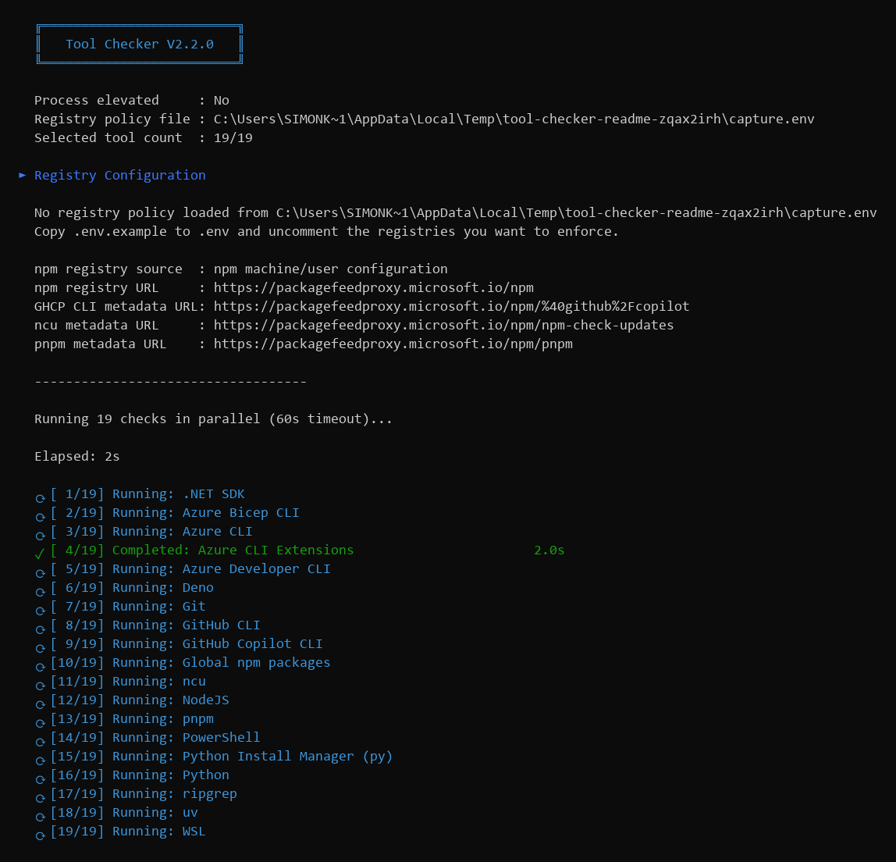
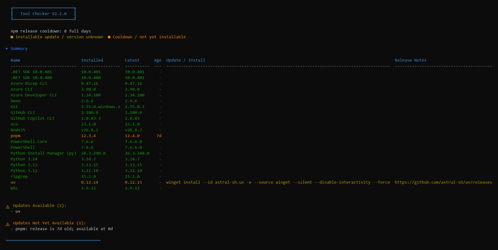
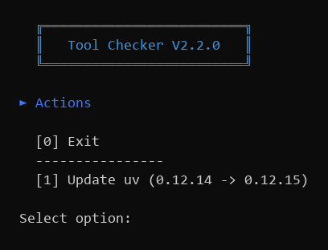

# Tool Checker

Tool Checker is a PowerShell 7 script that inventories development tools, compares installed versions with upstream releases, and optionally installs missing tools or applies updates. Checks run in parallel and are driven by [`tool-checker.json`](tool-checker.json).

Checks npm releases from newest to oldest and selects the newest production version that has completed the catalog-configured cooldown (eight full days by default, overridable at runtime). If no newer mature version exists, the young latest release remains visible but cannot be selected until the cooldown expires. Incomplete version or release-age lookups are reported as `unknown` instead of appearing current.

The included configuration checks:

- Node.js and global npm packages
- npm-check-updates (`ncu`), pnpm, Deno, and uv
- Azure CLI, Azure Developer CLI, Azure CLI extensions, and Bicep
- .NET SDKs, Python Install Manager (`py`), and Python installations
- Git, GitHub CLI, GitHub Copilot CLI, and ripgrep
- WSL and PowerShell

Tool Checker supports Windows and Linux on AMD64 and ARM64. Some configured tools or update commands are platform-specific; for example, WSL is checked only on Windows and several Windows updates use WinGet.

## See it in action

The following screenshots show Tool Checker `1.2.0` validating registry policy and metadata sources, tracking parallel checks with a live elapsed-time and per-check progress indicator, reporting release age and cooldown status in the consolidated inventory, and refreshing registry checks after an explicitly approved alignment.







## Requirements

- [PowerShell 7 or later](https://learn.microsoft.com/powershell/scripting/install/installing-powershell)
- Internet access to query release APIs and package registries
- The package managers used by your configured install and update commands, such as WinGet, npm, or `apt`
- [tool-checker.ps1](tool-checker.ps1), [tool-checker.json](tool-checker.json), and the bundled `Tools/` and `Infra/` directories kept together
- An optional `.env` tool-selection and registry policy based on [`.env.example`](.env.example)

The script does not require installation or additional PowerShell modules.

## Usage

From PowerShell, run:

```powershell
./tool-checker.ps1
```

Checks run concurrently, followed by a summary showing installed and latest versions, release age, available commands, and release-note links. If actions are available, an interactive menu lets you select one or more comma-separated action numbers. Press Enter or select `0` to exit without making further changes.

### Options

| Option | Description |
| --- | --- |
| `-SkipUpdate` | Check which tools are installed without querying for or applying updates. Alias: `-CheckOnly`. Missing tools can still appear in the action menu. |
| `-Force` | Apply every actionable update without prompting. Updates run in parallel. This does not automatically install missing tools. |
| `-Timeout <seconds>` | Set the maximum time for each individual check. The default is 60 seconds. |
| `-CooldownDays <days>` | Override the catalog's npm release cooldown for this run. Nonnegative integer; `0` removes the age delay. |
| `-EnvFile <path>` | Read tool selection and registry policy from a specific dotenv file instead of `.env` beside the script. |
| `-Version` | Print the Tool Checker version and exit. |

Examples:

```powershell
# Run checks and choose actions interactively
./tool-checker.ps1

# Inventory installed and missing tools only
./tool-checker.ps1 -SkipUpdate

# Apply all available updates without prompts
./tool-checker.ps1 -Force

# Allow slower checks up to 60 seconds each
./tool-checker.ps1 -Timeout 60

# Override the catalog's cooldown for this run
./tool-checker.ps1 -CooldownDays 10

# Use a tool-selection and registry policy stored outside the repository
./tool-checker.ps1 -EnvFile C:\secure\tool-checker.env

# Print the script version
./tool-checker.ps1 -Version
```

Tool Checker executes the commands shown in the summary or action menu. Review [`tool-checker.json`](tool-checker.json) before using interactive actions or `-Force`, especially on a shared or managed machine.

### Tests

The characterization tests require Pester and run without invoking tool checks or update actions:

```powershell
Invoke-Pester ./tests
```

### Tool selection and registry policy

Copy [`.env.example`](.env.example) to `.env`, then optionally set `TOOL_CHECKER_TOOLS` to a comma-separated list of catalog IDs. When it is omitted, Tool Checker checks every configured tool. The `.env` file and variant names such as `.env.local` are Git-ignored; `.env.example` remains tracked. Values may use quoted or unquoted dotenv syntax, and URL comparisons ignore a trailing slash.

`TOOL_CHECKER_TOOLS` accepts only the IDs defined in [`tool-checker.json`](tool-checker.json). Unknown IDs stop the run before tool checks start. The current catalog IDs are:

```text
nodejs, npm-check-updates, npm-global-packages, pnpm, deno, uv
azure-cli, azure-dev-cli, azure-cli-extensions, azure-bicep-cli
dotnet-sdk, python-install-manager, python
git, github-cli, github-copilot-cli, ripgrep, wsl, powershell
```

For example, this policy checks only the Azure tooling and .NET SDK:

```dotenv
TOOL_CHECKER_TOOLS=azure-cli,azure-dev-cli,azure-cli-extensions,azure-bicep-cli,dotnet-sdk
```

Registry variables remain optional and are evaluated independently of catalog selection:

- `NPM_CONFIG_REGISTRY`: checks the npm user registry; repairs it with `npm config set registry <url> --location=user`.
- `PNPM_CONFIG_REGISTRY`: checks the pnpm global registry; repairs it with `pnpm config set registry <url> --location=global`. The location form avoids pnpm's unrelated global executable-directory validation.
- `PIP_INDEX_URL`: checks pip's user `global.index-url`; repairs it with `<python> -m pip config --user set global.index-url <url>`.
- `UV_DEFAULT_INDEX`: checks uv's user-level default index; repairs it as `index-url` in uv's user `uv.toml` configuration file. Tool Checker also migrates the invalid `default-index` key written by versions 1.1.0 and 1.1.1.
- `NUGET_SOURCE_NAME`: identifies the NuGet source to check and defaults to `nuget.org`.
- `NUGET_SOURCE_URL`: checks the named NuGet source URL; repairs it with `dotnet nuget update source` or `dotnet nuget add source`.

Missing variables are ignored. The checker masks credentials embedded in registry URLs when displaying drift or actions. Keep `.env` local and restrict its filesystem permissions if it contains credentials.

Before parallel checks begin, Tool Checker reports the npm registry source, resolved registry URL, and package metadata URLs used for npm-hosted tools. These diagnostics make proxy and machine-level registry configuration issues visible without exposing credentials embedded in registry URLs.

For pip, Tool Checker selects an installed interpreter that provides pip. On Windows it explicitly targets the global Python 3 installation through `py -V:3`, preventing an active project virtual environment from intercepting user-level registry checks or repairs.

uv lock files contain exact package and artifact URLs. After changing `UV_DEFAULT_INDEX`, regenerate an existing lock with `uv lock` and commit the reviewed lock-file changes. `uv sync --locked` intentionally continues using the URLs already recorded in `uv.lock`; changing the user registry alone does not rewrite a lock file.

Before regenerating a lock, verify that the proxy exposes all metadata required by the project. In particular, projects that enforce uv's `exclude-newer` policy need artifact upload timestamps, and projects using PEP 658 metadata need every advertised metadata URL to be reachable. As of August 2026, Microsoft's PyPI proxy does not provide artifact upload timestamps and can advertise metadata URLs on `files.pythonhosted.org`. Consequently, registry alignment alone cannot repair `uv sync --locked` for APIM-Samples: preserve its existing lock file and resolve access to `files.pythonhosted.org`, or have the proxy corrected upstream without weakening the repository's dependency-age policy.

Registry alignment is intentionally approval-gated. In a normal run, each misaligned registry appears as an `Align ... registry` action. `-SkipUpdate` reports drift without offering a repair. `-Force` may apply tool updates automatically, but registry repairs still require an explicit action-menu selection.

Shared registry checks, repairs, and npm endpoint resolution live in
[Infra/registry.ps1](Infra/registry.ps1). The main script loads this file explicitly,
independently of tool selection; loading alone does not perform checks or repairs.

## Configuration

Tools are catalog entries under the top-level `tools` object in [`tool-checker.json`](tool-checker.json). Each property name is a unique, stable semantic ID made of lowercase letters, numbers, and hyphens; each entry's required `Name` field supplies the human-readable display name used by the script. Tool Checker sorts display names when loading selected entries and uses that order for both processing and display. Names are sorted alphabetically, with Azure CLI extensions grouped under Azure CLI and versioned .NET SDK and Python entries sorted by version descending.

There are two kinds of checks:

- `standard`: Uses the generic command, version parser, release API, and update-command framework. Most new command-line tools should use this type.
- `custom`: Calls `Test-Tool` in the `Tools/` file explicitly named by the catalog's `ToolFile` field for specialized behavior, such as multiple installed SDK channels. All custom checker implementations live in their tool files; shared checking, output, and orchestration remain in [tool-checker.ps1](tool-checker.ps1), with registry handling in [Infra/registry.ps1](Infra/registry.ps1).

### Add a standard tool

Add an entry like this:

```json
{
  "tools": {
    "example-cli": {
      "Name": "Example CLI",
      "enabled": true,
      "CheckType": "standard",
      "ProductionReleasesOnly": true,
      "Command": "example",
      "VersionFlag": "--version",
      "VersionParseRegex": "example ([0-9]+(?:\\.[0-9]+){1,3})",
      "WingetId": "Vendor.Example",
      "UpdateType": "winget",
      "UpdateCommand": "winget upgrade Vendor.Example --silent --disable-interactivity",
      "ReleaseNotesUrl": "https://github.com/cli/cli/releases",
      "ApiUrl": "https://api.github.com/repos/cli/cli/releases/latest",
      "InstallCommands": {
        "Windows (amd64)": "winget install Vendor.Example --silent --disable-interactivity",
        "Windows (arm64)": "winget install Vendor.Example --silent --disable-interactivity",
        "Linux (amd64)": "sudo apt-get install -y example",
        "Linux (arm64)": "sudo apt-get install -y example"
      }
    }
  }
}
```

The generic API parser recognizes common `tag_name`, `version`, or `release` properties. GitHub's latest-release API works without a custom extractor. A leading `v` is removed before version comparison.

### Standard fields

| Field                          | Required              | Purpose                                                                                                                |
| ------------------------------ | --------------------- | ---------------------------------------------------------------------------------------------------------------------- |
| Catalog ID                     | Yes                   | The top-level `tools` property name: a unique semantic ID used in `TOOL_CHECKER_TOOLS`.                                |
| `Name`                         | Yes                   | Human-readable unique display name used in output and custom checker lookups.                                          |
| `enabled`                      | No                    | Set to `false` to skip this checker. Defaults to `true` when omitted.                                                  |
| `CheckType`                    | Yes                   | Set to `standard` or `custom`.                                                                                         |
| `Command`                      | Yes                   | Executable name used to detect whether the tool is installed.                                                          |
| `VersionFlag`                  | Usually               | Argument passed to `Command`; defaults to `--version`.                                                                 |
| `VersionCommand`               | No                    | Full command used instead of `Command` plus `VersionFlag`.                                                             |
| `VersionParseRegex`            | Recommended           | Regex whose first capture group is the installed version.                                                              |
| `VersionExtractor`             | No                    | Shared parser: `npmDistTagLatest` for npm releases or `jsonProperty` for installed JSON output.                        |
| `VersionProperty`              | For `jsonProperty`    | Top-level installed-version JSON property, for example `azure-cli`.                                                    |
| `ParseEntireVersionOutput`     | No                    | Apply `VersionParseRegex` to all output lines instead of only the first; return no version if it does not match.       |
| `PreferWingetInstalledVersion` | No                    | Prefer the installed WinGet package version, falling back to command output when unavailable.                          |
| `ApiVersionProperty`           | No                    | Dot-separated path to the API version, for example `info.version`; takes precedence over tag parsing.                  |
| `ApiVersionRegex`              | No                    | Regex whose first capture group extracts the version from an API `tag_name`.                                           |
| `ApiUrl`                       | Yes for update checks | Endpoint used to determine the latest release.                                                                         |
| `WingetId`                     | WinGet updates        | Exact package ID passed to `winget show --id ... -e` to determine the latest installable catalog version.              |
| `ProductionReleasesOnly`       | No                    | Accepts optional `v` + `major.minor.patch[.0]`, without a suffix. Defaults to `true`; `false` permits prereleases.     |
| `UpdateParseRegex`             | No                    | Extracts an available version from a self-reporting version command instead of the API result.                         |
| `UpdateType`                   | Recommended           | Identifies the command family for execution and error handling, such as `winget`, `direct`, or `npm-global`.           |
| `UpdateCommand`                | Yes for updates       | PowerShell command executed to update the tool.                                                                        |
| `WindowsUpdateCommand`         | No                    | Windows-only override for `UpdateCommand`.                                                                             |
| `InstallCommands`              | No                    | Platform-specific commands offered when the tool is missing.                                                           |
| `ReleaseNotesUrl`              | No                    | Link displayed when an update is actionable.                                                                           |
| `ToolFile`                     | No for standard tools | Explicit filename under `Tools/`; a loaded `Refresh-ToolStatus` overrides standard post-update refresh.                |

`InstallCommands` supports these platform keys:

```text
Windows (amd64)
Windows (arm64)
Linux (amd64)
Linux (arm64)
```

If the exact architecture is absent, Tool Checker falls back to the first command for the current operating system. If no matching command exists, the missing tool is reported but cannot be installed from the menu.

### npm packages

For an npm-hosted CLI, set `VersionExtractor` to `npmDistTagLatest` and provide `NpmPackageName`. Tool Checker uses the user's configured npm registry when possible and pins updates to the version it checked. When `ProductionReleasesOnly` is enabled, a prerelease `latest` tag falls back to the highest published version matching `major.minor.patch`. Numeric revision suffixes such as GitHub Copilot CLI's `1.0.83-2` are compared numerically when prereleases are enabled.

The catalog defines the npm release cooldown at the top level, alongside `tools`:

```json
"settings": {
  "CooldownDays": 8
}
```

`settings.CooldownDays` is required and must be a nonnegative integer (at most 2147483647). There is no hard-coded script fallback. `-CooldownDays <days>` takes precedence for the current run without modifying the catalog; `0` removes the age delay but retains version filtering and release-metadata checks. The resolved value applies to npm-hosted CLI updates and global npm package updates, including parallel checks and action eligibility. It does not add cooldowns to other release sources. `-Force` still respects the resolved cooldown.

The cooldown applies after release filtering, before newly published npm package versions become actionable. Younger releases remain visible as informational updates but are not installed.

### Add a custom tool

Use a custom entry only when the standard framework cannot model the check:

```json
{
  "tools": {
    "example-sdk": {
      "Name": "Example SDK",
      "enabled": true,
      "CheckType": "custom",
      "CustomFunction": "Test-Tool",
      "ToolFile": "example-sdk.ps1",
      "Command": "example"
    }
  }
}
```

Start from [Tools/_tool-template.ps1](Tools/_tool-template.ps1) and add the corresponding function to `Tools/example-sdk.ps1`:

```powershell
function Test-Tool {
    param([string]$Progress)

    Write-Header "Checking Example SDK" -Progress $Progress
  # Resolve $installedVersion and $latestVersion, then register an update:
  if (Register-ToolUpdate `
      -Name 'Example SDK' `
      -InstalledVersion $installedVersion `
      -LatestVersion $latestVersion `
      -Command 'example update' `
      -Type 'direct') {
    Write-Warning "Example SDK update available: $installedVersion -> $latestVersion"
  }
}
```

Custom checker functions must accept a `Progress` string. After catalog selection, Tool Checker registers functions only from declared `ToolFile` files for selected, enabled tools, in catalog-ID order, then validates configured checks. `ToolFile` is a .ps1 filename directly under `Tools/`, not a path or the template. Omit it when no specialized file is needed; invalid filenames and missing declared files fail startup. Filenames are never inferred from catalog IDs. Unselected, disabled, undeclared, and template files are not loaded. Workers receive the same per-tool definition registry, including private helpers. `Invoke-ToolEntryPoint` dispatches by catalog ID in a local call scope, so every file can use `Test-Tool`, `Refresh-ToolStatus`, `Invoke-ToolInstall`, and `Invoke-ToolUpdate` without name collisions. Files must define functions only and follow the public naming and private-helper region conventions in [Tools/_tool-template.ps1](Tools/_tool-template.ps1).

If normal semantic version comparison applies, call `Register-ToolUpdate`; it adds a newer version to both the summary and actionable update collections. For specialized flows that manage summary state separately, call `Add-AvailableUpdate` with `Name`, `Command`, `Type`, and optional `Details` values. Specialized actions can also supply `RegistryKey` for registry alignment or `Version` for a version-specific installer.

## Output and behavior

- Green rows are installed and current, or were run in check-only mode without an update lookup.
- Yellow rows have an actionable install or update, or the latest version could not be determined.
- Orange rows identify npm releases still in cooldown.
- Red rows identify failed updates, missing tools, or checks that timed out before inventory completed.
- A timed-out check is stopped and reported without preventing other checks from completing. A whole-check timeout shows `unknown` in red; an installed tool whose latest-version lookup did not complete shows `unknown` in yellow rather than appearing current.
- After an interactive action, Tool Checker refreshes the displayed version when a refresh handler is available.

Release APIs and package catalogs can disagree temporarily. For most Windows tools updated through WinGet, Tool Checker treats the exact package's WinGet catalog version as authoritative for both the displayed latest version and update availability. Node.js is the exception: its official distribution index controls the displayed latest version. When WinGet lags, Tool Checker offers the architecture-specific official MSI, verifies it against Node.js's published SHA-256 checksum, and installs it silently. Machine-wide Node.js MSI upgrades trigger a just-in-time UAC consent prompt when Tool Checker is not already elevated; only the installer process receives administrator rights. Known "no applicable upgrade" responses remain retry-later conditions rather than successful updates.

On Windows, Azure Developer CLI uses its installed WinGet package version for inventory and post-update verification when available. For example, `azd version` can report `1.33.0` while the installed package is `1.33.100`. Comparing the package version with the WinGet catalog avoids offering an update that is already installed. If the package lookup is unavailable, the script falls back to the CLI-reported version.

On Windows, uv installs and updates use one non-interactive WinGet path. Before installing, Tool Checker removes a registered WinGet copy, detected pipx or Cargo copies, and leftover `uv`, `uvx`, and `uvw` binaries from the current user's `.local\bin` and `.cargo\bin` directories. It then performs a clean WinGet install. This standardizes future updates without deleting uv's cache, managed Python installations, or installed tools. On Linux, uv continues to use Astral's standalone installer and `uv self update`.

## Contributing

See [CONTRIBUTING.md](CONTRIBUTING.md) for the development workflow and the
requirements for proposing or implementing a tool catalog addition.

## License

Licensed under the terms in [`LICENSE`](LICENSE).
